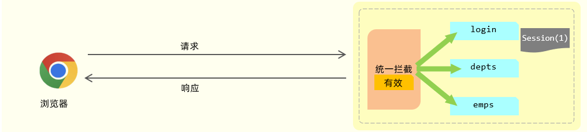
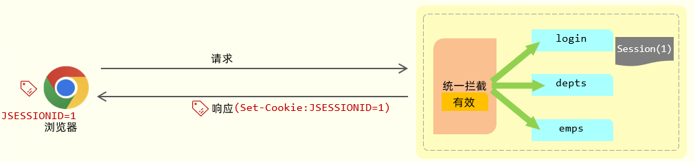
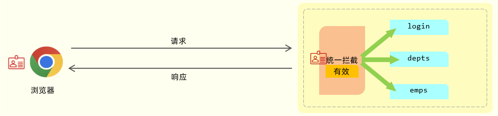

# 2023年10月后端开发学习日志

## 10月2日 周一

### 早上，学习记录

10：15开始学习。

#### 前后台分离开发


**接口文档**：前后台开发人员都需要遵循的统一开发规范

后台开发者开发一个功能的具体流程：

 

1. 需求分析：首先我们需要阅读需求文档，分析需求，理解需求。
2. 接口定义：查询接口文档中关于需求的接口的定义，包括地址，参数，响应数据类型等等
3. 前后台并行开发：各自按照接口文档进行开发，实现需求
4. 测试：前后台开发完了，各自按照接口文档进行测试
5. 前后端联调测试：前端工程请求后端工程，测试功能

#### YAPI

YAPI：一个撰写接口文档的平台

YApi主要提供了2个功能：

- API接口管理：根据需求撰写接口，包括接口的地址，参数，响应等等信息。
- Mock服务：模拟真实接口，生成接口的模拟测试数据，用于前端的测试。

#### 前端工程化

**前端工程化**：在企业级的前端项目开发中，把前端开发所需要的工具、技术、流程、经验进行**规范化**和**标准化**。从而提升开发效率，降低开发难度等等。

案例：

前端工程化是通过Vue官方提供的脚手架Vue-cli来完成的，用于快速的生成一个Vue的项目模板。

##### 问题记录

在按照NodeJs安装文档安装完vue cli后


1. 应该是系统环境变量的问题，在安装Node时没有设置好安装目录

2. 决定删除重装

3. 重装过程中发现了问题所在，

   在配置npm的全局安装路径，使用管理员身份运行命令行，在命令行中，执行如下指令：

   ```
   npm config set prefix "E:\develop\NodeJS"
   ```

   注意：E:\develop\NodeJS 这个目录是NodeJS的安装目录，自己的**安装目录书写错误**

   ### 下班

###  11：40下班

   ### 中午，下午学习记录

12：45在饭后清了一些游戏日常后，开始继续学习

#### 前端工程化入门案例

##### Vue项目开发流程

**vue组件**：.vue结尾的文件

vue的组件文件包含3个部分：

- **template**: 模板部分，主要是HTML代码，用来展示页面主体结构的
- **script**: js代码区域，主要是通过js代码来控制模板的数据来源和**行为**的
- **style**: css样式部分，主要通过css样式控制模板的**页面效果**得

如下图所示就是一个vue组件的小案例：


基于前端框架的开发主要是对App.vue文件的编写与设计

#### Vue组件库Element

**Element**：是饿了么公司前端开发团队提供的**一套基于 Vue 的网站组件库，用于快速构建网页**

**ElementUI**：一款侧重于V开发(**视图开发**)的前端框架，主要用于开发美观的页面

##### Element快速入门

###### 问题记录

在跟着教程一步步实现快速入门的时候，最后运行的时候，**又又又又**是**文件路径书写错误**

##### Elment组件

- **Table**表格组件
- **Pagination**分页组件

- **Dialog**对话框组件
- **Form**表单组件

###### 问题记录

在实现Dialog案例的时候，一直无法正确显示视频中的效果，计划暂时搁置这个问题

### 15:50下班

今天，后端开发的学习时间约为4.5h。

## 10月3日 周二

### 早上学习记录

9：30开始学习

#### Element综合案例

##### 基本页面布局

对ElementUI官网的源码进行修改实现自己想要的页面布局效果

##### 页面组件实现

必须在data域中绑定页面中的属性，页面才会显示对应内容

##### axios异步加载数据

在跟着教程视频完成最后一个步骤

##### 总结


#### Vue路由

##### Vue路由基本概念

**前端路由**：URL中的hash(#号之后的内容）与组件之间的对应关系，如下图所示：


当我们点击左侧导航栏时，浏览器的地址栏会发生变化，路由自动更新显示与url所对应的vue组件。

vue官方提供了路由插件**Vue Router**,其主要组成如下：

- VueRouter：路由器类，根据路由请求在路由视图中动态渲染选中的组件
- &lt;router-link&gt;：请求链接组件，浏览器会解析成&lt;a&gt;
- &lt;router-view&gt;：动态视图组件，用来渲染展示与路由路径对应的组件


其工作原理如下图所示：


首先VueRouter根据我们配置的url的hash片段和路由的组件关系去维护一张路由表;

然后我们页面提供一个&lt;router-link&gt;组件,用户点击，发出路由请求;

接着我们的VueRouter根据路由请求，在路由表中找到对应的vue组件；

最后VueRouter会切换&lt;router-view&gt;中的组件，从而进行视图的更新

##### VueRouter入门

大概了解VueRouter使用的基本思路，这部分自己没有跟着视频教程一步步做

### 下班

11：30下班，干饭！！！

### 中午，下午，学习记录

12：30开始继续学习

##### Nginx

**Nginx**: 一款轻量级的**Web服务器**/反向代理服务器及电子邮件（IMAP/POP3）代理服务器。其特点是**占有内存少，并发能力强**，在各大型互联网公司都有非常广泛的使用。

##### Maven

**Maven**：Apache旗下的一个开源项目，是**一款用于管理和构建java项目的工具**。

**Maven的作用**

1. 依赖管理
2. 统一项目结构
3. 项目构建

##### 在IDEA中配置Maven

将系统自动设置的Maven仓库迁移到了D盘指定目录

### 下班

14：30 javaweb教程学习下班！！！

## 10月4日 周三

### 早上，学习记录

10：20开始学习

**Spring Boot 可以帮助我们非常快速的构建应用程序、简化开发、提高效率 。**

#### SpringBoot快速入门

跟着视频教程快速入门，同时将报错信息control c/v 到csdn上找到了解决方法

#### HTTP

HTTP：Hyper Text Transfer Protocol(超文本传输协议)，**规定了浏览器与服务器之间数据传输的规则**。

- http是互联网上应用最为广泛的一种网络协议 
- http协议要求：浏览器在向服务器发送**请求数据**时，或是服务器在向浏览器发送**响应数据**时，都必须按照固定的格式进行数据传输

##### HTTP协议的特点

我们在看看HTTP协议有哪些特点：

* **基于TCP协议: **   面向连接，安全
* **基于请求-响应模型:**   一次请求对应一次响应（先请求后响应）
* **HTTP协议是无状态协议:**  对于数据没有记忆能力。每次请求-响应都是独立的

HTTP协议又分为：**请求协议**和**响应协议**

- 请求协议：浏览器将数据以请求格式发送到服务器
  - 包括：**请求行**、**请求头** 、**请求体** 
- 响应协议：服务器将数据以响应格式返回给浏览器
  - 包括：**响应行** 、**响应头** 、**响应体** 

##### HTTP-请求协议

在HTTP1.1版本中，浏览器访问服务器的几种方式： 

| 请求方式 | 请求说明                                                                                                                                                                                        |
| :------: | :---------------------------------------------------------------------------------------------------------------------------------------------------------------------------------------------- |
| **GET**  | 获取资源。<br/>向特定的资源发出请求。例：http://www.baidu.com/s?wd=itheima                                                                                                                      |
| **POST** | 传输实体主体。<br/>向指定资源提交数据进行处理请求（例：上传文件），数据被包含在请求体中。                                                                                                       |
| OPTIONS  | 返回服务器针对特定资源所支持的HTTP请求方式。<br/>因为并不是所有的服务器都支持规定的方法，为了安全有些服务器可能会禁止掉一些方法，例如：DELETE、PUT等。那么OPTIONS就是用来询问服务器支持的方法。 |
|   HEAD   | 获得报文首部。<br/>HEAD方法类似GET方法，但是不同的是HEAD方法不要求返回数据。通常用于确认URI的有效性及资源更新时间等。                                                                           |
|   PUT    | 传输文件。<br/>PUT方法用来传输文件。类似FTP协议，文件内容包含在请求报文的实体中，然后请求保存到URL指定的服务器位置。                                                                            |
|  DELETE  | 删除文件。<br/>请求服务器删除Request-URI所标识的资源                                                                                                                                            |
|  TRACE   | 追踪路径。<br/>回显服务器收到的请求，主要用于测试或诊断                                                                                                                                         |
| CONNECT  | 要求用隧道协议连接代理。<br/>HTTP/1.1协议中预留给能够将连接改为管道方式的代理服务器                                                                                                             |

在我们实际应用中常用的也就是 ：**GET、POST**

######  GET方式的请求协议：

 

* 请求行 ：HTTP请求中的第一行数据。由：`请求方式`、`资源路径`、`协议/版本`组成（之间使用空格分隔）

  * 请求方式：GET  
  * 资源路径：/brand/findAll?name=OPPO&status=1
    * 请求路径：/brand/findAll
    * 请求参数：name=OPPO&status=1
      * 请求参数是以key=value形式出现
      * 多个请求参数之间使用`&`连接
    * 请求路径和请求参数之间使用`?`连接 			 
  * 协议/版本：HTTP/1.1  

* 请求头 ：第二行开始，上图黄色部分内容就是请求头。格式为key: value形式 

  - http是个无状态的协议，所以在请求头设置浏览器的一些自身信息和想要响应的形式。这样服务器在收到信息后，就可以知道是谁，想干什么了

  常见的HTTP请求头有:

  ~~~
  Host: 表示请求的主机名
  
  User-Agent: 浏览器版本。 例如：Chrome浏览器的标识类似Mozilla/5.0 ...Chrome/79 ，IE浏览器的标识类似Mozilla/5.0 (Windows NT ...)like Gecko
  
  Accept：表示浏览器能接收的资源类型，如text/*，image/*或者*/*表示所有；
  
  Accept-Language：表示浏览器偏好的语言，服务器可以据此返回不同语言的网页；
  
  Accept-Encoding：表示浏览器可以支持的压缩类型，例如gzip, deflate等。
  
  Content-Type：请求主体的数据类型
  
  Content-Length：数据主体的大小（单位：字节）
  ~~~

> 举例说明：服务端可以根据请求头中的内容来获取客户端的相关信息，有了这些信息服务端就可以处理不同的业务需求。
>
> 比如:
>
> - 不同浏览器解析HTML和CSS标签的结果会有不一致，所以就会导致相同的代码在不同的浏览器会出现不同的效果
> - 服务端根据客户端请求头中的数据获取到客户端的浏览器类型，就可以根据不同的浏览器设置不同的代码来达到一致的效果（这就是我们常说的浏览器兼容问题）

- 请求体 ：存储请求参数

  - GET请求的请求参数在请求行中，故不需要设置请求体

###### POST方式的请求协议：	

  

  

  - 请求行(以上图中红色部分)：包含请求方式、资源路径、协议/版本
    - 请求方式：POST
    - 资源路径：/brand
    - 协议/版本：HTTP/1.1
  - 请求头(以上图中黄色部分)   
  - 请求体(以上图中绿色部分) ：存储请求参数 
    - 请求体和请求头之间是有一个空行隔开（作用：用于标记请求头结束）

###### GET请求和POST请求的区别：

| 区别方式     | GET请求                                                        | POST请求             |
| ------------ | -------------------------------------------------------------- | -------------------- |
| 请求参数     | 请求参数在请求行中。<br/>例：/brand/findAll?name=OPPO&status=1 | 请求参数在请求体中   |
| 请求参数长度 | 请求参数长度有限制(浏览器不同限制也不同)                       | 请求参数长度没有限制 |
| 安全性       | 安全性低。原因：请求参数暴露在浏览器地址栏中。                 | 安全性相对高         |

##### HTTP-响应协议

HTTP响应的数据也分为3部分：**响应行**、**响应头** 、**响应体** 

 

* 响应行(以上图中红色部分)：响应数据的第一行。响应行由`协议及版本`、`响应状态码`、`状态码描述`组成

  * 协议/版本：HTTP/1.1
  * 响应状态码：200
  * 状态码描述：OK

* 响应头(以上图中黄色部分)：响应数据的第二行开始。格式为key：value形式

  * http是个无状态的协议，所以可以在请求头和响应头中设置一些信息和想要执行的动作，这样，对方在收到信息后，就可以知道你是谁，你想干什么

  常见的HTTP响应头有:

  ~~~
  Content-Type：表示该响应内容的类型，例如text/html，image/jpeg ；
  
  Content-Length：表示该响应内容的长度（字节数）；
  
  Content-Encoding：表示该响应压缩算法，例如gzip ；
  
  Cache-Control：指示客户端应如何缓存，例如max-age=300表示可以最多缓存300秒 ;
  
  Set-Cookie: 告诉浏览器为当前页面所在的域设置cookie ;
  ~~~

- 响应体(以上图中绿色部分)： 响应数据的最后一部分。存储响应的数据
  - 响应体和响应头之间有一个空行隔开（作用：用于标记响应头结束）

###### 响应状态码

| 状态码分类 | 说明                                                                                                        |
| ---------- | ----------------------------------------------------------------------------------------------------------- |
| 1xx        | **响应中** --- 临时状态码。表示请求已经接受，告诉客户端应该继续请求或者如果已经完成则忽略                   |
| 2xx        | **成功** --- 表示请求已经被成功接收，处理已完成                                                             |
| 3xx        | **重定向** --- 重定向到其它地方，让客户端再发起一个请求以完成整个处理                                       |
| 4xx        | **客户端错误** --- 处理发生错误，责任在客户端，如：客户端的请求一个不存在的资源，客户端未被授权，禁止访问等 |
| 5xx        | **服务器端错误** --- 处理发生错误，责任在服务端，如：服务端抛出异常，路由出错，HTTP版本不支持等             |

参考: 资料/SpringbootWeb/响应状态码.md

关于**响应状态码**，我们先主要认识三个状态码，其余的等后期用到了再去掌握：

* 200    ok   客户端请求成功
* 404  Not Found  请求资源不存在
* 500  Internal Server Error  服务端发生不可预期的错误

##### HTTP-协议解析

Java后端使用Socket类解析接收到的HTTP协议

### 下班

11：40下班！！！干饭！！！

### 中午，下午，学习记录

12：40

#### Web服务器-Tomcat

**Web服务器**：应用程序(软件)，对HTTP协议的操作进行封装，使得程序员不必直接对协议进行操作(不用程序员自己写代码去解析http协议规则)，让Web开发更加便捷。主要功能是"**提供网上信息浏览服务**"。

**Tomcat**：一款简便易用的Web服务器软件。

##### SpringBoot框架内置Tomcat

SpringBoot起步依赖：以`spring-boot-starter-`作为开头的依赖

常用起步依赖：

- spring-boot-starter-web：包含了web应用开发所需要的常见依赖
- spring-boot-starter-test：包含了单元测试所需要的常见依赖

我们可以通过IDEA开发工具右侧的maven面板中，就可以看到当前工程引入的依赖。其中已经将Tomcat的相关依赖传递下来了，也就是说在SpringBoot中可以直接使用Tomcat服务器。


#### 读程序员鱼皮知识星球的文章 

14：30开始

15：30结束

### 下班

15：30下班

## 10月7日 周六

### 早上学习记录

9：30开始学习

#### 基础知识

##### DispatcherServlet

SpringBoot进行web程序开发时，它内置了一个核心的Servlet程序 DispatcherServlet，称之为 **核心控制器**。 DispatcherServlet 负责接收页面发送的请求，然后根据执行的规则，将请求再转发给后面的请求处理器Controller，请求处理器处理完请求之后，最终再由DispatcherServlet给浏览器响应数据。

##### BS架构

 

BS架构：Browser/Server，浏览器/服务器架构模式。客户端只需要浏览器，应用程序的逻辑和数据都存储在服务端。

#### 请求

##### Postman

 

- Postman是一款功能强大的网页调试与**发送网页HTTP请求**的Chrome插件。

  > Postman原是Chrome浏览器的插件，可以模拟浏览器向后端服务器发起任何形式(如:get、post)的HTTP请求
  >
  > 使用Postman还可以在发起请求时，携带一些请求参数、请求头等信息

- 作用：常用于进行接口测试

##### 向服务端传递简单参数

对于简单参数，参数名与形参变量名相同，定义同名的形参即可接收参数。

```
@RestController
public class RequestController {
    // http://localhost:8080/simpleParam?name=Tom&age=10
    // 第1个请求参数： name=Tom   参数名:name，参数值:Tom
    // 第2个请求参数： age=10     参数名:age , 参数值:10
    
    //springboot方式
    @RequestMapping("/simpleParam")
    public String simpleParam(String name , Integer age ){//形参名和请求参数名保持一致
        System.out.println(name+"  :  "+age);
        return "OK";
    }
}
```

**postman测试( POST请求 )：**


> **结论：不论是GET请求还是POST请求，对于简单参数来讲，只要保证==请求参数名和Controller方法中的形参名保持一致==，就可以获取到请求参数中的数据值。**

##### 向服务端传递实体参数

将请求参数封装到一个实体类对象中。 要想完成数据封装，需要遵守如下规则：**请求参数名与实体类的属性名相同**

 

定义POJO实体类：

```java
public class User {
    private String name;
    private Integer age;

    public String getName() {
        return name;
    }

    public void setName(String name) {
        this.name = name;
    }

    public Integer getAge() {
        return age;
    }

    public void setAge(Integer age) {
        this.age = age;
    }

    @Override
    public String toString() {
        return "User{" +
                "name='" + name + '\'' +
                ", age=" + age +
                '}';
    }
}

```

Controller方法：

```java
@RestController
public class RequestController {
    //实体参数：简单实体对象
    @RequestMapping("/simplePojo")
    public String simplePojo(User user){
        System.out.println(user);
        return "OK";
    }
}
```

复杂实体对象指的是，在实体类中有一个或多个属性，也是实体对象类型的。如下：

- User类中有一个Address类型的属性（Address是一个实体类）


Controller方法：

```java
@RestController
public class RequestController {
    //实体参数：复杂实体对象
    @RequestMapping("/complexPojo")
    public String complexPojo(User user){
        System.out.println(user);
        return "OK";
    }
}
```

Postman测试：


##### 向服务端传递数组集合参数

###### 数组

**请求参数名与形参数组名称相同且请求参数为多个，定义数组类型形参即可接收参数**


Controller方法：

```java
@RestController
public class RequestController {
    //数组集合参数
    @RequestMapping("/arrayParam")
    public String arrayParam(String[] hobby){
        System.out.println(Arrays.toString(hobby));
        return "OK";
    }
}
```

###### 集合

**请求参数名与形参集合对象名相同且请求参数为多个，@RequestParam 绑定参数关系**

> 默认情况下，请求中参数名相同的多个值，是封装到数组。如果要封装到集合，要使用@RequestParam绑定参数关系


Controller方法：

```java
@RestController
public class RequestController {
    //数组集合参数
    @RequestMapping("/listParam")
    public String listParam(@RequestParam List<String> hobby){
        System.out.println(hobby);
        return "OK";
    }
}
```

###### 小结


##### 向服务端传递日期参数

日期类型的参数在进行封装的时候，需要通过@DateTimeFormat注解，以及其pattern属性来设置日期的格式。


- @DateTimeFormat注解的pattern属性中指定了哪种日期格式，前端的日期参数就必须按照指定的格式传递。
- 后端controller方法中，需要使用Date类型或LocalDateTime类型，来封装传递的参数。

Controller方法：

```java
@RestController
public class RequestController {
    //日期时间参数
   @RequestMapping("/dateParam")
    public String dateParam(@DateTimeFormat(pattern = "yyyy-MM-dd HH:mm:ss") LocalDateTime updateTime){
        System.out.println(updateTime);
        return "OK";
    }
}
```

##### 向服务端传递JSON参数

Postman发送JSON格式数据：


服务端Controller方法接收JSON格式数据：

- 传递json格式的参数，在Controller中会使用实体类进行封装。 
- 封装规则：**JSON数据键名与形参对象属性名相同，定义POJO类型形参即可接收参数。需要使用 @RequestBody标识。**


- @RequestBody注解：将JSON数据映射到形参的实体类对象中（JSON中的key和实体类中的属性名保持一致）

Controller方法：

```java
@RestController
public class RequestController {
    //JSON参数
    @RequestMapping("/jsonParam")
    public String jsonParam(@RequestBody User user){
        System.out.println(user);
        return "OK";
    }
}
```

##### 路径参数

在现在的开发中，经常还会直接在请求的URL中传递参数。例如：

~~~
http://localhost:8080/user/1		
http://localhost:880/user/1/0
~~~

上述的这种传递请求参数的形式呢，我们称之为：路径参数。

学习路径参数呢，主要掌握在后端的controller方法中，如何接收路径参数。

路径参数：

- 前端：通过请求URL直接传递参数
- 后端：使用{…}来标识该路径参数，需要使用@PathVariable获取路径参数


Controller方法：

```java
@RestController
public class RequestController {
    //路径参数
    @RequestMapping("/path/{id}")
    public String pathParam(@PathVariable Integer id){
        System.out.println(id);
        return "OK";
    }
}
```

##### 小结


### 中午，下午，学习记录

12：40干完饭后决定继续学习

#### 响应

##### @ResponseBody

**@ResponseBody注解：**

- 类型：方法注解、类注解
- 位置：书写在Controller方法上或类上
- 作用：将方法返回值直接响应给浏览器
  - 如果返回值类型是实体对象/集合，将会转换为JSON格式后再响应给浏览器

在类上添加的**@RestController**注解，是一个组合注解。

- @RestController = @Controller + @ResponseBody 

结论：在类上添加@RestController就相当于添加了@ResponseBody注解。

##### 统一响应结果

在真实的项目开发中，无论是哪种方法，我们都会定义一个统一的返回结果。方案如下：


> 前端：只需要按照统一格式的返回结果进行解析(仅一种解析方案)，就可以拿到数据。

统一的返回结果使用类来描述，在这个结果中包含：

- 响应状态码：当前请求是成功，还是失败

- 状态码信息：给页面的提示信息

- 返回的数据：给前端响应的数据（字符串、对象、集合）

##### 小结


### 下班

由于忘记带充电宝，笔记本电脑没电啦！！！13：30下班！！！

## 10月9日 周一

### 晚上学习记录

#### 请求响应综合案例

##### 问题记录

在实现案例的过程中，无法从后端拿到数据

原因：路径中含有中文，导致无法正确找到路径

#### 分层解耦

##### 三层架构

在我们项目开发中呢，可以将代码分为三层：


- Controller：控制层。接收前端发送的请求，对请求进行处理，并响应数据。
- Service：业务逻辑层。处理具体的业务逻辑。
- Dao：数据访问层(Data Access Object)，也称为持久层。负责数据访问操作，包括数据的增、删、改、查。

基于三层架构的程序执行流程：


- 前端发起的请求，由Controller层接收（Controller响应数据给前端）
- Controller层调用Service层来进行逻辑处理（Service层处理完后，把处理结果返回给Controller层）
- Serivce层调用Dao层（逻辑处理过程中需要用到的一些数据要从Dao层获取）
- Dao层操作文件中的数据（Dao拿到的数据会返回给Service层）

> 思考：按照三层架构的思想，如何要对业务逻辑(Service层)进行变更，会影响到Controller层和Dao层吗？ 
>
> 答案：不会影响。 （程序的扩展性、维护性变得更好了）

三层架构的好处：

1. 复用性强
2. 便于维护
3. 利于扩展

##### 高内聚低耦合

软件开发涉及到的两个概念：内聚和耦合。

- 内聚：软件中各个功能模块内部的功能联系。
- 耦合：衡量软件中各个层/模块之间的依赖、关联的程度。

**软件设计原则：高内聚低耦合。**

> 高内聚指的是：一个模块中各个元素之间的联系的紧密程度，如果各个元素(语句、程序段)之间的联系程度越高，则内聚性越高，即 "高内聚"。
>
> 低耦合指的是：软件中各个层、模块之间的依赖关联程序越低越好。

高内聚、低耦合的目的是使程序模块的可重用性、移植性大大增强。

实现上述**解耦操作**，就涉及到Spring中的两个核心概念：

- **控制反转：** Inversion Of Control，简称IOC。对象的创建控制权由程序自身转移到外部（容器），这种思想称为控制反转。

  > 对象的创建权由程序员主动创建转移到容器(由容器创建、管理对象)。这个容器称为：IOC容器或Spring容器

- **依赖注入：** Dependency Injection，简称DI。容器为应用程序提供运行时，所依赖的资源，称之为依赖注入。

  > 程序运行时需要某个资源，此时容器就为其提供这个资源。
  >
  > 例：EmpController程序运行时需要EmpService对象，Spring容器就为其提供并注入EmpService对象

IOC容器中创建、管理的对象，称之为：bean对象

#### Bean的声明

要把某个对象交给IOC容器管理，需要在对应的类上加上如下注解之一：

| 注解        | 说明                 | 位置                                            |
| :---------- | -------------------- | ----------------------------------------------- |
| @Controller | @Component的衍生注解 | 标注在控制器类上                                |
| @Service    | @Component的衍生注解 | 标注在业务类上                                  |
| @Repository | @Component的衍生注解 | 标注在数据访问类上（由于与mybatis整合，用的少） |
| @Component  | 声明bean的基础注解   | 不属于以上三类时，用此注解                      |

#### DI依赖注入

在IOC容器中，存在多个相同类型的bean对象时，为了解决bean对象冲突，Spring提供了以下几种解决方案：

- @Primary

- @Qualifier

- @Resource

###### @Primary

使用@Primary注解：当存在多个相同类型的Bean注入时，加上@Primary注解，来确定默认的实现。

 

###### @Qualifier

使用@Qualifier注解：指定当前要注入的bean对象。 在@Qualifier的value属性中，指定注入的bean的名称。

- @Qualifier注解不能单独使用，必须配合@Autowired使用


###### @Resource

使用@Resource注解：是按照bean的名称进行注入。通过name属性指定要注入的bean的名称。


> 面试题 ： @Autowird 与 @Resource的区别
>
> - @Autowired 是spring框架提供的注解，而@Resource是JDK提供的注解
> - @Autowired 默认是按照类型注入，而@Resource是按照名称注入

## 10月13日 周五

### 下午学习记录

#### SQL

**SQL**：结构化查询语言。一门操作关系型数据库的编程语言，定义操作所有关系型数据库的统一标准。

##### SQL通用语法

1、SQL语句可以单行或多行书写，以分号结尾。


2、SQL语句可以使用空格/缩进来增强语句的可读性。


3、MySQL数据库的SQL语句不区分大小写。


4、注释：

- 单行注释：-- 注释内容   或   # 注释内容(MySQL特有)
- 多行注释： /* 注释内容 */

SQL语句根据其功能被分为四大类：DDL、DML、DQL、DCL 

| **分类** | **全称**                    | **说明**                                               |
| -------- | --------------------------- | ------------------------------------------------------ |
| DDL      | Data Definition  Language   | 数据定义语言，用来定义数据库对象(数据库，表，字段)     |
| DML      | Data Manipulation  Language | 数据操作语言，用来对数据库表中的数据进行增删改         |
| DQL      | Data Query Language         | 数据查询语言，用来查询数据库中表的记录                 |
| DCL      | Data Control  Language      | 数据控制语言，用来创建数据库用户、控制数据库的访问权限 |

##### 数据库操作语句

**查询所有数据库：**

```mysql
show databases;
```

**查询当前数据库：**

```mysql
select database();
```

**创建数据库：**

```
create database [ if not exists ] 数据库名;
```

**使用数据库：**

```
use itcast;
```

**删除数据库：**

```
drop database [ if exists ] 数据库名 ;
```

##### 表操作语句

```
create table  表名(
	字段1  字段1类型 [约束]  [comment  字段1注释 ],
	字段2  字段2类型 [约束]  [comment  字段2注释 ],
	......
	字段n  字段n类型 [约束]  [comment  字段n注释 ] 
) [ comment  表注释 ] ;
```

##### 约束

**约束：**作用在表中字段上的规则，用于限制存储在表中的数据。

在MySQL数据库当中，提供了以下5种约束：

| **约束** | **描述**                                         | **关键字**     |
| -------- | ------------------------------------------------ | -------------- |
| 非空约束 | 限制该字段值不能为null                           | not null       |
| 唯一约束 | 保证字段的所有数据都是唯一、不重复的             | unique         |
| 主键约束 | 主键是一行数据的唯一标识，要求非空且唯一         | primary key    |
| 默认约束 | 保存数据时，如果未指定该字段值，则采用默认值     | default        |
| 外键约束 | 让两张表的数据建立连接，保证数据的一致性和完整性 | foreign key    |
| 自增约束 | 让值自动增长，常用于主键自增                     | auto_increment |

> 注意：约束是作用于表中字段上的，可以在创建表/修改表的时候添加约束。

##### 数据类型

**数值类型**

| 类型        | 大小   | 有符号(SIGNED)范围                                    | 无符号(UNSIGNED)范围                                       | 描述               |
| ----------- | ------ | ----------------------------------------------------- | ---------------------------------------------------------- | ------------------ |
| TINYINT     | 1byte  | (-128，127)                                           | (0，255)                                                   | 小整数值           |
| SMALLINT    | 2bytes | (-32768，32767)                                       | (0，65535)                                                 | 大整数值           |
| MEDIUMINT   | 3bytes | (-8388608，8388607)                                   | (0，16777215)                                              | 大整数值           |
| INT/INTEGER | 4bytes | (-2147483648，2147483647)                             | (0，4294967295)                                            | 大整数值           |
| BIGINT      | 8bytes | (-2^63，2^63-1)                                       | (0，2^64-1)                                                | 极大整数值         |
| FLOAT       | 4bytes | (-3.402823466 E+38，3.402823466351 E+38)              | 0 和 (1.175494351  E-38，3.402823466 E+38)                 | 单精度浮点数值     |
| DOUBLE      | 8bytes | (-1.7976931348623157 E+308，1.7976931348623157 E+308) | 0 和  (2.2250738585072014 E-308，1.7976931348623157 E+308) | 双精度浮点数值     |
| DECIMAL     |        | 依赖于M(精度)和D(标度)的值                            | 依赖于M(精度)和D(标度)的值                                 | 小数值(精确定点数) |

```sql
示例: 
    年龄字段 ---不会出现负数, 而且人的年龄不会太大
	age tinyint unsigned
	
	分数 ---总分100分, 最多出现一位小数
	score double(4,1)
```

**字符串类型**

| 类型       | 大小                  | 描述                         |
| ---------- | --------------------- | ---------------------------- |
| CHAR       | 0-255 bytes           | 定长字符串(需要指定长度)     |
| VARCHAR    | 0-65535 bytes         | 变长字符串(需要指定长度)     |
| TINYBLOB   | 0-255 bytes           | 不超过255个字符的二进制数据  |
| TINYTEXT   | 0-255 bytes           | 短文本字符串                 |
| BLOB       | 0-65 535 bytes        | 二进制形式的长文本数据       |
| TEXT       | 0-65 535 bytes        | 长文本数据                   |
| MEDIUMBLOB | 0-16 777 215 bytes    | 二进制形式的中等长度文本数据 |
| MEDIUMTEXT | 0-16 777 215 bytes    | 中等长度文本数据             |
| LONGBLOB   | 0-4 294 967 295 bytes | 二进制形式的极大文本数据     |
| LONGTEXT   | 0-4 294 967 295 bytes | 极大文本数据                 |

char 与 varchar 都可以描述字符串，char是定长字符串，指定长度多长，就占用多少个字符，和字段值的长度无关 。而varchar是变长字符串，指定的长度为最大占用长度 。相对来说，char的性能会更高些。

```sql
示例： 
    用户名 username ---长度不定, 最长不会超过50
	username varchar(50)
	
	手机号 phone ---固定长度为11
	phone char(11)
```

**日期时间类型**

| 类型      | 大小 | 范围                                       | 格式                | 描述                     |
| --------- | ---- | ------------------------------------------ | ------------------- | ------------------------ |
| DATE      | 3    | 1000-01-01 至  9999-12-31                  | YYYY-MM-DD          | 日期值                   |
| TIME      | 3    | -838:59:59 至  838:59:59                   | HH:MM:SS            | 时间值或持续时间         |
| YEAR      | 1    | 1901 至 2155                               | YYYY                | 年份值                   |
| DATETIME  | 8    | 1000-01-01 00:00:00 至 9999-12-31 23:59:59 | YYYY-MM-DD HH:MM:SS | 混合日期和时间值         |
| TIMESTAMP | 4    | 1970-01-01 00:00:01 至 2038-01-19 03:14:07 | YYYY-MM-DD HH:MM:SS | 混合日期和时间值，时间戳 |

```sql
示例: 
	生日字段  birthday ---生日只需要年月日  
	birthday date
	
	创建时间 createtime --- 需要精确到时分秒
	createtime  datetime
```
## 10月14日-10月23日
因为一时手贱shift+delete永久删除了这段时间的学习日志记录，所以。。。。。。~~绝对不是俺想销毁我是蒟蒻的证据~~

## 10月24日 周四

### talis项目员工相关功能模块开发

#### 员工分页查询功能开发

问题记录：在开发员工分页功能查询的时候，不知道如何使用Mybatis自带的分页插件PageHelper实现分页查询功能

#### 批量删除员工功能开发

出现错误后，将报错信息ctrl c/v到csdn上得到了解决

## 10月25日 周三

### 开发talis-web-management系统新增员工功能

开发新增员工功能的工作并不困难，重要的是学会了使用第三方服务：将图片上传到阿里云服务器。

### 开发talis-web-management系统修改员工信息功能

#### yml配置文件

yml文件中常见的数据格式。在这里我们主要介绍最为常见的两类：

1. 定义对象或Map集合
2. 定义数组、list或set集合

对象/Map集合

```yml
user:
  name: zhangsan
  age: 18
  password: 123456
```

数组/List/Set集合

```yml
hobby: 
  - java
  - game
  - sport
```

#### @ConfigurationProperties

直接将配置文件中配置项的值自动的注入到对象的属性中。


### 登录功能开发

## 10月26日 周四

### 登录校验
登录校验：我们在服务器端接收到浏览器发送过来的请求之后，首先我们要对请求进行校验。先要校验一下用户登录了没有，如果用户已经登录了，就直接执行对应的业务操作就可以了；如果用户没有登录，此时就不允许他执行相关的业务操作，直接给前端响应一个错误的结果，最终跳转到登录页面，要求他登录成功之后，再来访问对应的数据。

### 无状态协议：
无状态协议：无状态，指的是每一次请求都是独立的，下一次请求并不会携带上一次请求的数据。而浏览器与服务器之间进行交互，基于HTTP协议也就意味着现在我们通过浏览器来访问了登陆这个接口，实现了登陆的操作，接下来我们在执行其他业务操作时，服务器也并不知道这个员工到底登陆了没有。因为HTTP协议是无状态的，两次请求之间是独立的，所以是无法判断这个员工到底登陆了没有。

### 统一拦截技术
统一拦截技术：拦截浏览器发送过来的所有的请求，拦截到这个请求之后，就可以通过请求来获取之前所存入的登录标记，在获取到登录标记且标记为登录成功，就说明员工已经登录了。如果已经登录，我们就直接放行(意思就是可以访问正常的业务接口了)。

### 会话技术
**会话：** 在web开发当中，会话指的就是浏览器与服务器之间的一次连接，我们就称为一次会话。
**会话跟踪：** 一种维护浏览器状态的方法，服务器需要识别多次请求是否来自于同一浏览器，以便在同一次会话的多次请求间共享数据。
会话跟踪技术有两种：

1. Cookie（客户端会话跟踪技术）
   - 数据存储在客户端浏览器当中
2. Session（服务端会话跟踪技术）
   - 数据存储在储在服务端
3. 令牌技术

#### Cookie技术 
3个流程
- 服务器会 **自动** 的将 cookie 响应给浏览器。

- 浏览器接收到响应回来的数据之后，会 **自动** 的将 cookie 存储在浏览器本地。

- 在后续的请求当中，浏览器会 **自动** 的将 cookie 携带到服务器端。
**优缺点：**
- 优点：HTTP协议中支持的技术（像Set-Cookie 响应头的解析以及 Cookie 请求头数据的携带，都是浏览器自动进行的，是无需我们手动操作的）
- 缺点：
  - 移动端APP(Android、IOS)中无法使用Cookie
  - 不安全，用户可以自己禁用Cookie
  - Cookie不能跨域
  
- 现在的项目，大部分都是前后端分离的，前后端最终也会分开部署，前端部署在服务器 192.168.150.200 上，端口 80，后端部署在 192.168.150.100上，端口 8080
- 我们打开浏览器直接访问前端工程，访问url：http://192.168.150.200/login.html
- 然后在该页面发起请求到服务端，而服务端所在地址不再是localhost，而是服务器的IP地址192.168.150.100，假设访问接口地址为：http://192.168.150.100:8080/login
- 那此时就存在跨域操作了，因为我们是在 http://192.168.150.200/login.html 这个页面上访问了http://192.168.150.100:8080/login 接口
- 此时如果服务器设置了一个Cookie，这个Cookie是不能使用的，因为Cookie无法跨域


区分跨域的维度：

- 协议
- IP/协议
- 端口

只要上述的三个维度有任何一个维度不同，那就是跨域操作

#### Session技术
- 获取Session


 

  如果我们现在要基于 Session 来进行会话跟踪，浏览器在第一次请求服务器的时候，我们就可以直接在服务器当中来获取到会话对象Session。如果是第一次请求Session ，会话对象是不存在的，这个时候服务器会自动的创建一个会话对象Session 。而每一个会话对象Session ，它都有一个ID（示意图中Session后面括号中的1，就表示ID），我们称之为 Session 的ID。

 

- 响应Cookie (JSESSIONID)
 


  接下来，服务器端在给浏览器响应数据的时候，它会将 Session 的 ID 通过 Cookie 响应给浏览器。其实在响应头当中增加了一个 Set-Cookie 响应头。这个  Set-Cookie  响应头对应的值是不是cookie？ cookie 的名字是固定的 JSESSIONID 代表的服务器端会话对象 Session 的 ID。浏览器会自动识别这个响应头，然后自动将Cookie存储在浏览器本地。


- 查找Session

  

 

  接下来，在后续的每一次请求当中，都会将 Cookie 的数据获取出来，并且携带到服务端。接下来服务器拿到JSESSIONID这个 Cookie 的值，也就是 Session 的ID。拿到 ID 之后，就会从众多的 Session 当中来找到当前请求对应的会话对象Session。

  

  这样我们是不是就可以通过 Session 会话对象在同一次会话的多次请求之间来共享数据了？好，这就是基于 Session 进行会话跟踪的流程。

#### 令牌技术（主流登录校验技术）

令牌：一个用户身份的标识，本质就是一个字符串。

 

如果通过令牌技术来跟踪会话，我们就可以在浏览器发起请求。在请求登录接口的时候，**如果登录成功，我就可以生成一个令牌，令牌就是用户的合法身份凭证。接下来我在响应数据的时候，我就可以直接将令牌响应给前端。**

接下来我们在前端程序当中接收到令牌之后，就需要将这个令牌存储起来。这个存储可以存储在 cookie 当中，也可以存储在其他的存储空间(比如：localStorage)当中。

接下来，在后续的每一次请求当中，都需要将令牌携带到服务端。携带到服务端之后，接下来我们就需要来校验令牌的有效性。如果令牌是有效的，就说明用户已经执行了登录操作，如果令牌是无效的，就说明用户之前并未执行登录操作。

此时，如果是在同一次会话的多次请求之间，我们想共享数据，我们就可以将共享的数据存储在令牌当中就可以了。


**优缺点**

- 优点：
  - 支持PC端、移动端
  - 解决集群环境下的认证问题
  - 减轻服务器的存储压力（无需在服务器端存储）
- 缺点：需要自己实现（包括令牌的生成、令牌的传递、令牌的校验）

#### JWT令牌

**JWT令牌：**定义了一种简洁的、自包含的格式，用于在通信双方以json数据格式安全的传输信息。由于数字签名的存在，这些信息是可靠的。

**JWT的组成：** （JWT令牌由三个部分组成，三个部分之间使用英文的点来分割）

- 第一部分：Header(头）， 记录令牌类型、签名算法等。 例如：{"alg":"HS256","type":"JWT"}

- 第二部分：Payload(有效载荷），携带一些自定义信息、默认信息等。 例如：{"id":"1","username":"Tom"}

- 第三部分：Signature(签名），防止Token被篡改、确保安全性。将header、payload，并加入指定秘钥，通过指定签名算法计算而来。

  >签名的目的就是为了防jwt令牌被篡改，而正是因为jwt令牌最后一个部分数字签名的存在，所以整个jwt 令牌是非常安全可靠的。一旦jwt令牌当中任何一个部分、任何一个字符被篡改了，整个令牌在校验的时候都会失败，所以它是非常安全可靠的。


在JWT登录认证的场景中我们发现，整个流程当中涉及到两步操作：

1. 在登录成功之后，要生成令牌。
2. 每一次请求当中，要接收令牌并对令牌进行校验。

### 过滤器 Filter

什么是Filter？

- Filter表示**过滤器**，是 JavaWeb三大组件(Servlet、Filter、Listener)之一。
- 过滤器可以**把对资源的请求拦截下来**，从而实现一些特殊的功能
  - 使用了过滤器之后，要想访问web服务器上的资源，必须先经过滤器，过滤器处理完毕之后，才可以访问对应的资源。
- 过滤器一般完成一些通用的操作，比如：登录校验、统一编码处理、敏感字符处理等。

#### 拦截路径

| 拦截具体路径 | /login        | 只有访问 /login 路径时，才会被拦截 |
| ------------ | ------------- | ---------------------------------- |
| 拦截路径     | urlPatterns值 | 含义                               |
| 目录拦截     | /emps/*       | 访问/emps下的所有资源，都会被拦截  |
| 拦截所有     | /*            | 访问所有资源，都会被拦截           |

#### 过滤器链

过滤器链：在一个web应用程序当中，可以配置多个过滤器，多个过滤器就形成了一个过滤器链。

### 异常处理

#### 全局异常处理器

- 定义全局异常处理器非常简单，就是定义一个类，在类上加上一个注解@RestControllerAdvice，加上这个注解就代表我们定义了一个全局异常处理器。
- 在全局异常处理器当中，需要定义一个方法来捕获异常，在这个方法上需要加上注解@ExceptionHandler。通过@ExceptionHandler注解当中的value属性来指定我们要捕获的是哪一类型的异常。

~~~java
@RestControllerAdvice
public class GlobalExceptionHandler {

    //处理异常
    @ExceptionHandler(Exception.class) //指定能够处理的异常类型
    public Result ex(Exception e){
        e.printStackTrace();//打印堆栈中的异常信息

        //捕获到异常之后，响应一个标准的Result
        return Result.error("对不起,操作失败,请联系管理员");
    }
}
~~~

> @RestControllerAdvice = @ControllerAdvice + @ResponseBody
>
> 处理异常的方法返回值会转换为json后再响应给前端

以上就是全局异常处理器的使用，主要涉及到两个注解：

- @RestControllerAdvice  //表示当前类为全局异常处理器
- @ExceptionHandler  //指定可以捕获哪种类型的异常进行处理
