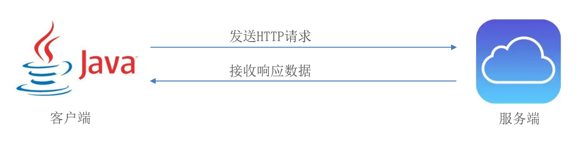
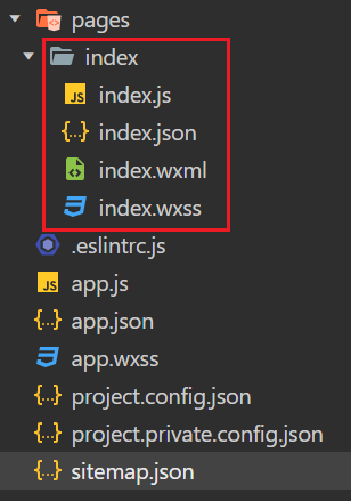
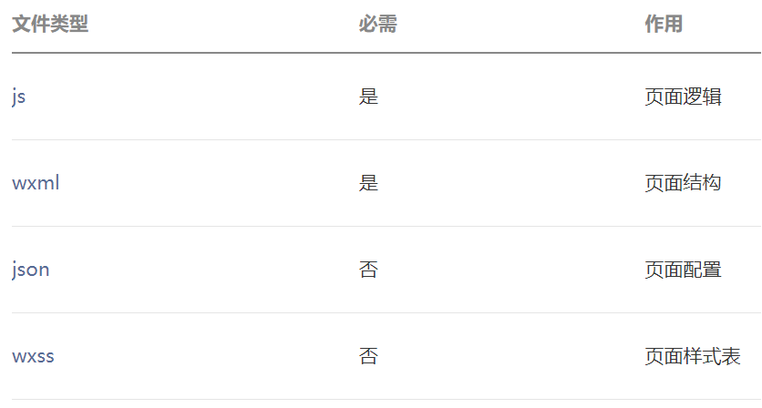
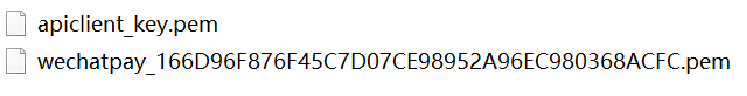
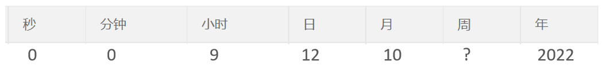

# 2023年11月后端开发学习日志

## 11月1日 周三

### Redis

- Redis是一个基于**内存**的key-value结构数据库。
- Redis 是互联网技术领域使用最为广泛的**存储中间件**。

**主要特点：**

- 基于内存存储，**读写性能高**  
- 适合存储热点数据（热点商品、资讯、新闻）
- 企业应用广泛

#### Redis数据类型

Redis存储的是key-value结构的数据，其中key是字符串类型，value有5种常用的数据类型：

- 字符串 string
- 哈希 hash
- 列表 list
- 集合 set
- 有序集合 sorted set / zset

 

**解释说明：**

- 字符串(string)：普通字符串，Redis中最简单的数据类型
- 哈希(hash)：也叫散列，类似于Java中的HashMap结构
- 列表(list)：按照插入顺序排序，可以有重复元素，类似于Java中的LinkedList
- 集合(set)：无序集合，没有重复元素，类似于Java中的HashSet
- 有序集合(sorted set/zset)：集合中每个元素关联一个分数(score)，根据分数升序排序，没有重复元素

#### 在Java中操作Redis

Spring 对 Redis 客户端进行了整合，提供了 **Spring Data Redis**，在Spring Boot项目中还提供了对应的Starter，即 spring-boot-starter-data-redis。

##### Spring Data Redis

Spring Data Redis中提供了一个高度封装的类：**RedisTemplate**，对相关api进行了归类封装,将同一类型操作封装为operation接口，具体分类如下：

- ValueOperations：string数据操作
- SetOperations：set类型数据操作
- ZSetOperations：zset类型数据操作
- HashOperations：hash类型的数据操作
- ListOperations：list类型的数据操作

### 早上，开发进度记录

完成了苍穹外卖教程文档中day5的内容

## 11月2日 周四

### HttpClient

HttpClient 是Apache Jakarta Common 下的子项目，可以用来提供高效的、最新的、功能丰富的支持 HTTP 协议的客户端编程工具包，并且它支持 HTTP 协议最新的版本和建议。

 

**HttpClient作用：**

- 发送HTTP请求
- 接收响应数据

**HttpClient的核心API：**

- HttpClient：Http客户端对象类型，使用该类型对象可发起Http请求。
- HttpClients：可认为是构建器，可创建HttpClient对象。
- CloseableHttpClient：实现类，实现了HttpClient接口。
- HttpGet：Get方式请求类型。
- HttpPost：Post方式请求类型。

**HttpClient发送请求步骤：**

- 创建HttpClient对象
- 创建Http请求对象
- 调用HttpClient的execute方法发送请求

## 11月3日 周五

### 微信小程序

小程序是一种新的开放能力，开发者可以快速地开发一个小程序。可以在微信内被便捷地获取和传播，同时具有出色的使用体验。

#### 微信小程序开发学习

小程序包含一个描述整体程序的 app 和多个描述各自页面的 page。

每个小程序页面主要由四个文件组成：

 

**文件说明：**

 

**js文件：**必须存在，存放页面业务逻辑代码，编写的js代码。

**wxml文件：**必须存在，存放页面结构，主要是做页面布局，页面效果展示的，类似于HTML页面。

**json文件：**非必须，存放页面相关的配置。

**wxss文件：**非必须，存放页面样式表，相当于CSS文件。

#### 问题记录

晚上，在尝试跑Demo程序时一直跑不起来，并且没能通过csdn和chatGpt解决，但是发现直接导入教程资料中的代码却能够正常运行，所以决定先暂时放下这个Bug

## 11月4日 周六

### 早上，中午，进度记录

完成了苍穹外卖教程文档中Day6的内容

### 下午，开发记录

13：00开始下半场的开发工作

#### Spring Cache

Spring Cache 是一个框架，实现了基于注解的缓存功能，只需要简单地加一个注解，就能实现缓存功能。

在SpringCache中提供了很多缓存操作的注解，常见的是以下的几个：

| **注解**       | **说明**                                                     |
| -------------- | ------------------------------------------------------------ |
| @EnableCaching | 开启缓存注解功能，通常加在启动类上                           |
| @Cacheable     | 在方法执行前先查询缓存中是否有数据，如果有数据，则直接返回缓存数据；如果没有缓存数据，调用方法并将方法返回值放到缓存中 |
| @CachePut      | 将方法的返回值放到缓存中                                     |
| @CacheEvict    | 将一条或多条数据从缓存中删除                                 |

在spring boot项目中，使用缓存技术只需在项目中导入相关缓存技术的依赖包，并在启动类上使用@EnableCaching开启缓存支持即可。

例如，使用Redis作为缓存技术，只需要导入Spring data Redis的maven坐标即可。

#### 支付功能开发

由于开发微信支付功能，需要两个资质文件：

**获取微信支付平台证书、商户私钥文件：**

 

目前自己并没有这两个文件，所以决定先不开发微信支付功能

下班！！！下班！！！

## 11月6日 周日

### 上午开发进度记录

完成了苍穹外卖day9的开发内容

### 下午学习开发记录

13：30开始下午的学习与开发

#### Spring Task

**Spring Task** 是Spring框架提供的任务调度工具，可以按照约定的时间自动执行某个代码逻辑。

**定位：**定时任务框架

**作用：**定时自动执行某段Java代码

**强调：**只要是需要定时处理的场景都可以使用Spring Task

##### Corn表达式

**cron表达式**其实就是一个字符串，通过cron表达式可以**定义任务触发的时间**

**构成规则：**分为6或7个域，由空格分隔开，每个域代表一个含义

每个域的含义分别为：秒、分钟、小时、日、月、周、年(可选)

**举例：**

2022年10月12日上午9点整 对应的cron表达式为：**0 0 9 12 10 ? 2022**

 

**说明：**一般**日**和**周**的值不同时设置，其中一个设置，另一个用？表示。

#### WebSocket

**WebSocket** 是基于 TCP 的一种新的**网络协议**。它实现了浏览器与服务器全双工通信——浏览器和服务器只需要完成一次握手，两者之间就可以创建**持久性**的连接， 并进行**双向**数据传输。

**HTTP协议和WebSocket协议对比：**

- HTTP是**短连接**
- WebSocket是**长连接**
- HTTP通信是**单向**的，基于请求响应模式
- WebSocket支持**双向**通信
- HTTP和WebSocket底层都是TCP连接

**WebSocket缺点：**

服务器长期维护长连接需要一定的成本
各个浏览器支持程度不一
WebSocket 是长连接，受网络限制比较大，需要处理好重连

**结论：**WebSocket并不能完全取代HTTP，它只适合在特定的场景下使用

#### Apache Echarts

Apache ECharts 是一款基于 Javascript 的数据可视化图表库，提供直观，生动，可交互，可个性化定制的数据可视化图表。

#### Apache POI

Apache POI 是一个处理Miscrosoft Office各种文件格式的开源项目。简单来说就是，我们可以使用 POI 在 Java 程序中对Miscrosoft Office各种文件进行读写操作。
一般情况下，POI 都是用于操作 Excel 文件。

### 下午进度记录

今天一鼓作气完成了苍穹外卖day9、day10、day11、day12的开发内容，苍穹外卖项目开发工作完成，虽然其中包含了大量的ctrl c/v，但是也通过ctrl c/v了解了web开发的基本流程和设计思路。

苍穹外卖完结撒花！！！
