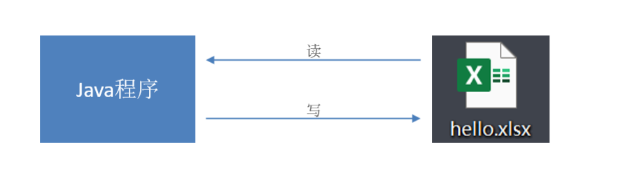
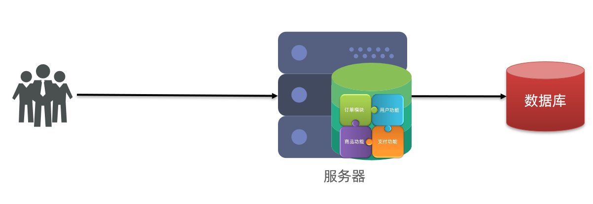
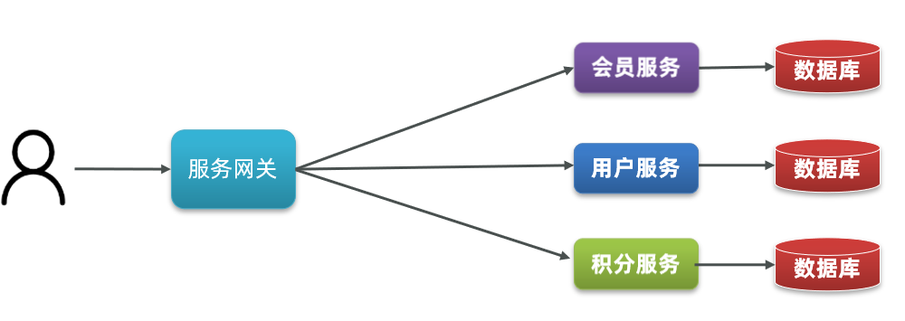

# 2023年11月后端开发学习日志

## 11月1日 周三

### Redis

- Redis是一个基于**内存**的key-value结构数据库。
- Redis 是互联网技术领域使用最为广泛的**存储中间件**。

**主要特点：**

- 基于内存存储，**读写性能高**  
- 适合存储热点数据（热点商品、资讯、新闻）
- 企业应用广泛

#### Redis数据类型

Redis存储的是key-value结构的数据，其中key是字符串类型，value有5种常用的数据类型：

- 字符串 string
- 哈希 hash
- 列表 list
- 集合 set
- 有序集合 sorted set / zset

 

**解释说明：**

- 字符串(string)：普通字符串，Redis中最简单的数据类型
- 哈希(hash)：也叫散列，类似于Java中的HashMap结构
- 列表(list)：按照插入顺序排序，可以有重复元素，类似于Java中的LinkedList
- 集合(set)：无序集合，没有重复元素，类似于Java中的HashSet
- 有序集合(sorted set/zset)：集合中每个元素关联一个分数(score)，根据分数升序排序，没有重复元素

#### 在Java中操作Redis

Spring 对 Redis 客户端进行了整合，提供了 **Spring Data Redis**，在Spring Boot项目中还提供了对应的Starter，即 spring-boot-starter-data-redis。

##### Spring Data Redis

Spring Data Redis中提供了一个高度封装的类：**RedisTemplate**，对相关api进行了归类封装,将同一类型操作封装为operation接口，具体分类如下：

- ValueOperations：string数据操作
- SetOperations：set类型数据操作
- ZSetOperations：zset类型数据操作
- HashOperations：hash类型的数据操作
- ListOperations：list类型的数据操作

### 早上，开发进度记录

完成了苍穹外卖教程文档中day5的内容

## 11月2日 周四

### HttpClient

HttpClient 是Apache Jakarta Common 下的子项目，可以用来提供高效的、最新的、功能丰富的支持 HTTP 协议的客户端编程工具包，并且它支持 HTTP 协议最新的版本和建议。

 

**HttpClient作用：**

- 发送HTTP请求
- 接收响应数据

**HttpClient的核心API：**

- HttpClient：Http客户端对象类型，使用该类型对象可发起Http请求。
- HttpClients：可认为是构建器，可创建HttpClient对象。
- CloseableHttpClient：实现类，实现了HttpClient接口。
- HttpGet：Get方式请求类型。
- HttpPost：Post方式请求类型。

**HttpClient发送请求步骤：**

- 创建HttpClient对象
- 创建Http请求对象
- 调用HttpClient的execute方法发送请求

## 11月3日 周五

### 微信小程序

小程序是一种新的开放能力，开发者可以快速地开发一个小程序。可以在微信内被便捷地获取和传播，同时具有出色的使用体验。

#### 微信小程序开发学习

小程序包含一个描述整体程序的 app 和多个描述各自页面的 page。

每个小程序页面主要由四个文件组成：

 

**文件说明：**

 

**js文件：**必须存在，存放页面业务逻辑代码，编写的js代码。

**wxml文件：**必须存在，存放页面结构，主要是做页面布局，页面效果展示的，类似于HTML页面。

**json文件：**非必须，存放页面相关的配置。

**wxss文件：**非必须，存放页面样式表，相当于CSS文件。

#### 问题记录

晚上，在尝试跑Demo程序时一直跑不起来，并且没能通过csdn和chatGpt解决，但是发现直接导入教程资料中的代码却能够正常运行，所以决定先暂时放下这个Bug

## 11月4日 周六

### 早上，中午，进度记录

完成了苍穹外卖教程文档中Day6的内容

### 下午，开发记录

13：00开始下半场的开发工作

#### Spring Cache

Spring Cache 是一个框架，实现了基于注解的缓存功能，只需要简单地加一个注解，就能实现缓存功能。

在SpringCache中提供了很多缓存操作的注解，常见的是以下的几个：

| **注解**       | **说明**                                                     |
| -------------- | ------------------------------------------------------------ |
| @EnableCaching | 开启缓存注解功能，通常加在启动类上                           |
| @Cacheable     | 在方法执行前先查询缓存中是否有数据，如果有数据，则直接返回缓存数据；如果没有缓存数据，调用方法并将方法返回值放到缓存中 |
| @CachePut      | 将方法的返回值放到缓存中                                     |
| @CacheEvict    | 将一条或多条数据从缓存中删除                                 |

在spring boot项目中，使用缓存技术只需在项目中导入相关缓存技术的依赖包，并在启动类上使用@EnableCaching开启缓存支持即可。

例如，使用Redis作为缓存技术，只需要导入Spring data Redis的maven坐标即可。

#### 支付功能开发

由于开发微信支付功能，需要两个资质文件：

**获取微信支付平台证书、商户私钥文件：**

 

目前自己并没有这两个文件，所以决定先不开发微信支付功能

下班！！！下班！！！

## 11月6日 周日

### 上午开发进度记录

完成了苍穹外卖day9的开发内容

### 下午学习开发记录

13：30开始下午的学习与开发

#### Spring Task

**Spring Task** 是Spring框架提供的任务调度工具，可以按照约定的时间自动执行某个代码逻辑。

**定位：**定时任务框架

**作用：**定时自动执行某段Java代码

**强调：**只要是需要定时处理的场景都可以使用Spring Task

##### Corn表达式

**cron表达式**其实就是一个字符串，通过cron表达式可以**定义任务触发的时间**

**构成规则：**分为6或7个域，由空格分隔开，每个域代表一个含义

每个域的含义分别为：秒、分钟、小时、日、月、周、年(可选)

**举例：**

2022年10月12日上午9点整 对应的cron表达式为：**0 0 9 12 10 ? 2022**

 

**说明：**一般**日**和**周**的值不同时设置，其中一个设置，另一个用？表示。

#### WebSocket

**WebSocket** 是基于 TCP 的一种新的**网络协议**。它实现了浏览器与服务器全双工通信——浏览器和服务器只需要完成一次握手，两者之间就可以创建**持久性**的连接， 并进行**双向**数据传输。

**HTTP协议和WebSocket协议对比：**

- HTTP是**短连接**
- WebSocket是**长连接**
- HTTP通信是**单向**的，基于请求响应模式
- WebSocket支持**双向**通信
- HTTP和WebSocket底层都是TCP连接

**WebSocket缺点：**

服务器长期维护长连接需要一定的成本
各个浏览器支持程度不一
WebSocket 是长连接，受网络限制比较大，需要处理好重连

**结论：**WebSocket并不能完全取代HTTP，它只适合在特定的场景下使用

#### Apache Echarts

Apache ECharts 是一款基于 Javascript 的数据可视化图表库，提供直观，生动，可交互，可个性化定制的数据可视化图表。

#### Apache POI

Apache POI 是一个处理Miscrosoft Office各种文件格式的开源项目。简单来说就是，我们可以使用 POI 在 Java 程序中对Miscrosoft Office各种文件进行读写操作。
一般情况下，POI 都是用于操作 Excel 文件。

### 下午进度记录

今天一鼓作气完成了苍穹外卖day9、day10、day11、day12的开发内容，苍穹外卖项目开发工作完成，虽然其中包含了大量的ctrl c/v，但是也通过ctrl c/v了解了web开发的基本流程和设计思路。

苍穹外卖完结撒花！！！

## 11月14日 周二

### 单体架构

**单体架构**：将业务的所有功能集中在一个项目中开发，打成一个包部署。

单体架构的优缺点如下：

**优点：**

- 架构简单
- 部署成本低

**缺点：**

- 耦合度高（维护困难、升级困难）

### 分布式架构

**分布式架构**：根据业务功能对系统做拆分，每个业务功能模块作为独立项目开发，称为一个服务。

**优点：**

- 降低服务耦合
- 有利于服务升级和拓展

**缺点：**

- 服务调用关系错综复杂

### 微服务

- 微服务的架构特征：

  - 单一职责：微服务拆分粒度更小，每一个服务都对应唯一的业务能力，做到单一职责
  - 自治：团队独立、技术独立、数据独立，独立部署和交付
  - 面向服务：服务提供统一标准的接口，与语言和技术无关
  - 隔离性强：服务调用做好隔离、容错、降级，避免出现级联问题

  

**微服务**是一种经过良好架构设计的**分布式架构方案** 。

### SpringCloud

SpringCloud是目前国内使用最广泛的微服务框架。

SpringCloud集成了各种微服务功能组件，并基于SpringBoot实现了这些组件的自动装配，从而提供了良好的开箱即用体验。

其中常见的组件包括：

### 架构总结

- 单体架构：简单方便，高度耦合，扩展性差，适合小型项目。例如：学生管理系统

- 分布式架构：松耦合，扩展性好，但架构复杂，难度大。适合大型互联网项目，例如：京东、淘宝

- 微服务：一种良好的分布式架构方案

  ①优点：拆分粒度更小、服务更独立、耦合度更低

  ②缺点：架构非常复杂，运维、监控、部署难度提高

- SpringCloud是微服务架构的一站式解决方案，集成了各种优秀微服务功能组件

### 服务拆分原则

微服务拆分时的几个原则：

- 不同微服务，不要重复开发相同业务
- 微服务数据独立，不要访问其它微服务的数据库
- 微服务可以将自己的业务暴露为接口，供其它微服务调用

### Demo案例

由于没有下载相关资料，所以暂时跳过Demo案例

### 提供者与消费者

在服务调用关系中，会有两个不同的角色：

**服务提供者**：一次业务中，被其它微服务调用的服务。（提供接口给其它微服务）

**服务消费者**：一次业务中，调用其它微服务的服务。（调用其它微服务提供的接口）

### EureKa

SpringCloud中的注册中心：Eureka，其结构如下：

问题1：order-service如何得知user-service实例地址？

获取地址信息的流程如下：

- user-service服务实例启动后，将自己的信息注册到eureka-server（Eureka服务端）。这个叫服务注册
- eureka-server保存服务名称到服务实例地址列表的映射关系
- order-service根据服务名称，拉取实例地址列表。这个叫服务发现或服务拉取

问题2：order-service如何从多个user-service实例中选择具体的实例？

- order-service从实例列表中利用负载均衡算法选中一个实例地址
- 向该实例地址发起远程调用

问题3：order-service如何得知某个user-service实例是否依然健康，是不是已经宕机？

- user-service会每隔一段时间（默认30秒）向eureka-server发起请求，报告自己状态，称为心跳
- 当超过一定时间没有发送心跳时，eureka-server会认为微服务实例故障，将该实例从服务列表中剔除
- order-service拉取服务时，就能将故障实例排除了

### 下午进度记录

下午遇到一个`找不到或无法加载主类`的报错，在CSDN上目前还没有找到有效的解决方法。

决定先吃饭下班，之后再解决问题

### BUG解决

果然，重装解决99%的问题，把原来的项目删除之后，重新创建项目，是模块的位置问题

### Eureka Demo

跑通了Demo案例，由于无线鼠标没有电了，所以决定今天的学习先到这里！！！

## 11月15日 周三

### Eureka服务注册

跟着视频、文档教程，实现服务注册Demo

### Ribbon负载均衡

SpringCloudRibbon的底层采用了一个拦截器，拦截了RestTemplate发出的请求，对地址做了修改。用一幅图来总结一下：

基本流程如下：

- 拦截我们的RestTemplate请求http://userservice/user/1
- RibbonLoadBalancerClient会从请求url中获取服务名称，也就是user-service
- DynamicServerListLoadBalancer根据user-service到eureka拉取服务列表
- eureka返回列表，localhost:8081、localhost:8082
- IRule利用内置负载均衡规则，从列表中选择一个，例如localhost:8081
- RibbonLoadBalancerClient修改请求地址，用localhost:8081替代userservice，得到http://localhost:8081/user/1，发起真实请求

### Nacos

Nacos是SpringCloudAlibaba的组件，而SpringCloudAlibaba也遵循SpringCloud中定义的服务注册、服务发现规范。因此使用Nacos和使用Eureka对于微服务来说，并没有太大区别。

主要差异在于：

- 依赖不同
- 服务地址不同

### Bug记录

安装完Nacos后，无法启动需要调用Nacos服务的OrderApplication和UserApplication

对照视频后，还是没有发现Bug所在，于是决定先放下这个Bug

### Nacos配置管理

当微服务部署的实例越来越多，达到数十、数百时，逐个修改微服务配置就会让人抓狂，而且很容易出错。我们需要一种统一配置管理方案，可以集中管理所有实例的配置。

Nacos一方面可以将配置集中管理，另一方可以在配置变更时，及时通知微服务，实现配置的热更新。

## 11月16日 周四

早上，10：15，开始投递完善简历

花了近2h左右的时间回顾自己的学习情况，完善了一份简历

## 11月17日 周五

早上，浏览了：快手、搜狐、B站、美团、米哈游等互联网企业的招聘信息

早上，明确了11月、12月的学习任务：

1. 微服务、中间件
2. 微服务项目开发
3. 了解算法工程师岗位，着重了解NLP算法工程师
4. 学习Linux操作系统
5. 准备学校课程的考试

## 11月18日 周六

下午，由于对于微服务的学习模棱两可，决定回顾前面所学，耐心的看黑马程序员微服务视频，看完了视频p1-p7，17：10决定下班干饭！！！

### 遗留问题解决

安装完Nacos后，无法启动需要调用Nacos服务的OrderApplication和UserApplication

自己的Eureka依赖没有删干净，眼睛没有吃油！！！菜菜菜！！！

## 11月19日 周日

### Nacos配置管理

微服务要拉取nacos中管理的配置，并且与本地的application.yml配置合并，才能完成项目启动。

但如果尚未读取application.yml，又如何得知nacos地址呢？

因此spring引入了一种新的配置文件：bootstrap.yaml文件，会在application.yml之前被读取，流程如下：

### Feign远程调用

Feign是一个声明式的http客户端，官方地址：https://github.com/OpenFeign/feign

其作用就是帮助我们优雅的实现http请求的发送

### Gateway服务网关

Spring Cloud Gateway 是 Spring Cloud 的一个全新项目，该项目是基于 Spring 5.0，Spring Boot 2.0 和 Project Reactor 等响应式编程和事件流技术开发的网关，它旨在为微服务架构提供一种简单有效的统一的 API 路由管理方式。

Gateway网关是我们服务的守门神，所有微服务的统一入口。

网关的**核心功能特性**：

- 请求路由
- 权限控制
- 限流

架构图：

**权限控制**：网关作为微服务入口，需要校验用户是是否有请求资格，如果没有则进行拦截。

**路由和负载均衡**：一切请求都必须先经过gateway，但网关不处理业务，而是根据某种规则，把请求转发到某个微服务，这个过程叫做路由。当然路由的目标服务有多个时，还需要做负载均衡。

**限流**：当请求流量过高时，在网关中按照下流的微服务能够接受的速度来放行请求，避免服务压力过大。

#### 过滤器工厂

过滤器的作用是什么？

① 对路由的请求或响应做加工处理，比如添加请求头

② 配置在路由下的过滤器只对当前路由的请求生效

defaultFilters的作用是什么？

① 对所有路由都生效的过滤器

