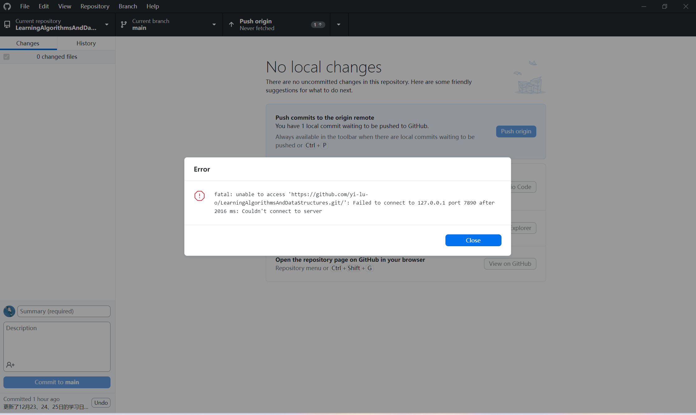
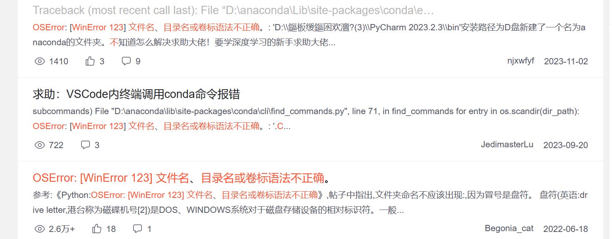
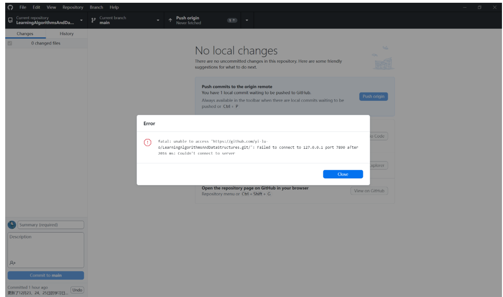
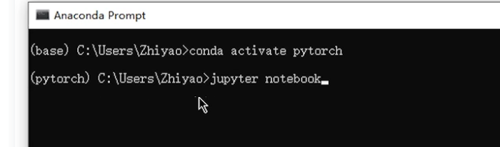
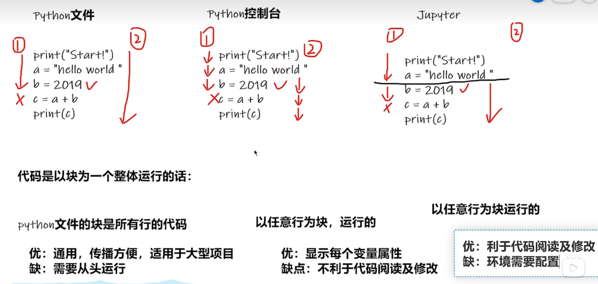
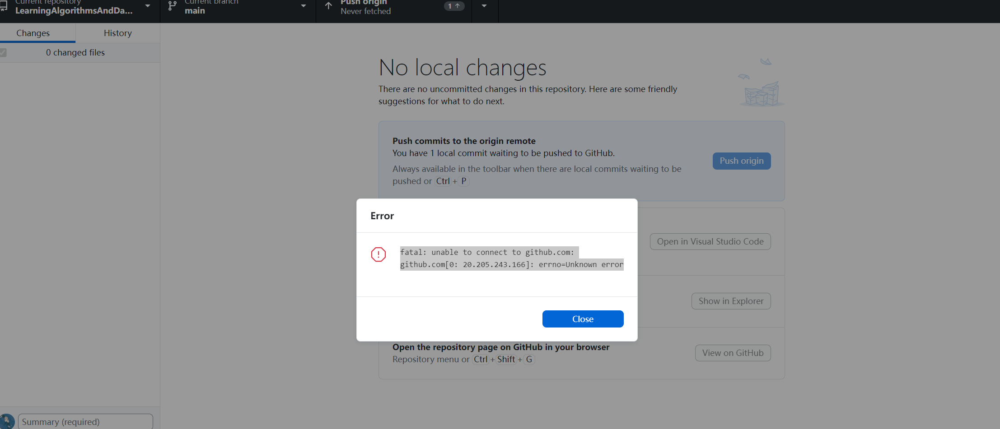

# 2023年12月后端开发学习日志

## 12月1日-12月20日

详情略

### 为什么没有这20天的详细记录呢？

1. 当代大学生面对期末考试的疲于奔命
2. 各种杂七杂八却又不得不做的事情
3. 零碎时间在刷力扣算法，在思考编程题
4. 零碎时间在围棋日常

## 12月21日 周四

1. 晚上，逛知识星球编程导航网站
2. 看程序员鱼皮的项目开发视频，充分利用互联网资源，向世界上优秀的人学习

## 12月22日 周五 

1. 开始了一个微服务的开发项目《黑马头条》，下好了相关资料，看了开头几个视频
2. 继续看程序员鱼皮的项目开发视频，学习他的开发思路和流程 
3. 恢复知识星球编程导航日常打卡

## 12月23日 周六

1. 系统性的了解chrome浏览器的使用以及相关设置
2. 原定计划做黑马的**黑马头条项目**(视频链接：`【黑马程序员Java项目实战微服务项目《黑马头条》开发全套视频教程，基于SpringBoot+SpringCloud+Nacos等企业级微服务架构项目解决方案】 https://www.bilibili.com/video/BV1Qs4y1v7x4/?p=6&share_source=copy_web&vd_source=d49737163f1128c1c86da93b5ff71eeb`)，然而，需要要百度网盘下12个G的虚拟机相关资料，最终决定不做这个项目
3. 浏览知识星球编程导航项目板块内容，寻找合适的微服务项目，最终决定做**硅谷课堂项目**(视频链接：`https://www.bilibili.com/video/BV13T411372x/`)
4. 中午，开始开发**硅谷课堂**项目，最开始打算参考mybatis-plus官网的快速开始文档搭建Demo，但是有Bug无法解决，跑不起来，最后还是决定参考尚硅谷的文档搭建Demo
5. 下午在开发项目的过程中想要查看以前写过的代码，发现以前的代码放的位置有些凌乱，于是花了一些时间整理代码和相关资料，在这个过程中也粗略的回顾了2023年自己的收获和不足
6. 再次尝试跑mybatis-plus的Demo，还是报错了`java.lang.IllegalStateException: Failed to load ApplicationContext`，并且按照网上的方法修改后，还是报同样的错误，决定先放下这个错误，**菜菜菜！！！**
6. 在尝试将日志记录推到GitHub上时发现无法访问GitHub，应该是梯子服务过期了，决定之后再推送到GitHub上

## 12月24日 周日

1. 中午，下午，看程序员鱼皮项目开发视频

## 12月25日 周一

啊啊啊！！！

被这个问题搞麻啦！！！csdn半天也没有解决 问题，排除了本地端口的 原因，那应该就是梯子的 原因，计划明天考完试后重新寻找有用的梯子服务

## 12月27日 周三

1. 看知识星球编程导航的简历部分内容，看了一些他人的简历

## 12月28日 周四

1. 看京东招聘官网信息，发现对于技术岗的要求并没有那么花里胡哨，还是着重于技术本身
2. 产生了学习一下深度学习框架`pytorch`的想法，自己想要走更有活力的路，保持学习，多学习些有活力的事物/知识是一个有更多可能性的选择。

## 12月29日 周五

### 问题记录1:

尝试学习深度学习框架`pytorch`，然而，又又又死在了第一步，csdn无果，知乎无果，chatGPT无果，如下：

啊啊啊！！！啊啊啊！！！决定先放下这个问题！！！

### 问题记录2：

再次尝试将本地git仓库推送到github上，通过尝试不同的解决方法还是无效，实在不行就卸了重装，啊啊啊啊啊啊！！！！！！

### 问题解决

1. 通过csdn博客文章`winError 123错误的解决`（链接：http://t.csdnimg.cn/ctjWW）解决了今天的`问题记录1`
2. 通过csdn博客文章`fatal: unable to access ‘https://github.com/.git/‘: Failed to conne拒绝连接`（链接：http://t.csdnimg.cn/iFl1C）解决了遗留了很久的问题`问题记录2`，下班！！！下班！！！

## 12月30日 周六

### 深度学习框架 Pytorch的学习

### 进入环境及使用Pytorch

### 更改jupyter notebook的工作目录

看csdn博客`Jupyter Notebooks的安装和使用介绍`(链接：http://t.csdnimg.cn/h6OVd)

### 使用插件`iLink网络加速器`访问github

`iLink网络加速器`插件非常好用，但是却导致本地git仓库无法推送到github上

解决过程：csdn博客`fatal: unable to connect to github.com:github.com[0: 20.205.243.166]: errno=Unknown error`(链接：http://t.csdnimg.cn/kdvxu)解决了这个问题