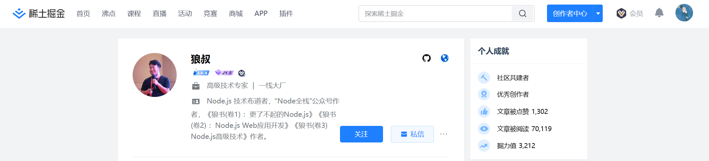
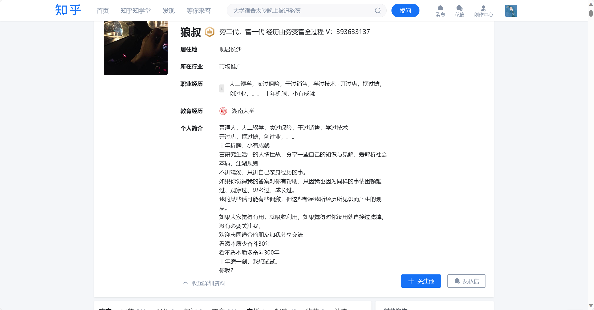

# 2024年1月后端开发学习日志

## 1月1日 周一

1. 逛稀土掘金社区，读到了一篇很有意思很有活力的文章`狼叔的2023总结`（链接），认识了一位有趣的开发者，多阅读，多体验，多尝试

## 1月6日 周六

1. 学习深度学习开发框架：pytorch
2. 了解了Kaggle竞赛平台，一个很好的竞赛与交流平台

## 1月8日 周一

学习pytorch框架(网课视频：【PyTorch深度学习快速入门教程（绝对通俗易懂！）【小土堆】】 https://www.bilibili.com/video/BV1hE411t7RN/?p=11&share_source=copy_web&vd_source=d49737163f1128c1c86da93b5ff71eeb)

大佬的GitHub学习笔记：[AccumulateMore/CV: ✔（已完结）最全面的 深度学习 笔记【土堆 Pytorch】【李沐 动手学深度学习】【吴恩达 深度学习】 (github.com)](https://github.com/AccumulateMore/CV)

充分利用网络资源进行学习

## 1月11日 周四

1. 学习深度学习框架pytorch

## 1月12日 周五

1. 早上，课kaggle入门课程(https://www.bilibili.com/cheese/play/ss3488?bsource=link_copy),约1.5h
2. 中午，下午，继续看kaggle入门课程,约1.5h
2. 晚上，继续看kaggle入门课程，约1.5h
### 数据竞赛介绍

### Kaggle前置知识
，，
### kaggle比赛类别

### Kaggle排位机制

### kaggle常用功能

## 1月13日 周五

### Python学习

#### Python性能

### 进度记录

晚上，完成了Kaggle网站`Intro to Programming`课程

## 1月22日 周一

### 深度学习入门

#### 单个神经元

#### 多元输入

#### 层

神经网络通常将它们的神经元组织成层。当我们将具有一组公共输入的线性单元收集在一起时，我们会得到一个密集层(dense layer)。

#### 激活函数

dense层本身永远无法将我们带出线和平面的世界。我们需要的是非线性的东西。我们需要的是激活函数(activation functions)。一般我们是将激活函数应用到每层的输出结果上，目前最常用的激活函数是整流函数

#### 损失函数

告诉网络要解决什么问题。这就是损失函数的工作。损失函数衡量目标的真实值与模型预测值之间的差异。
