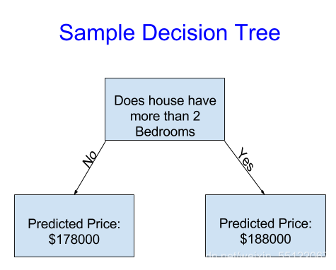

# 机器学习入门

## 1.决策树

决策树就是一棵树，其中跟节点和内部节点是输入特征的判定条件，叶子结点就是最终结果。



## 2.数据浏览基础

### pandas

```
import pandas as pd
```

#### DataFrames

可以把一个`DataFrame`的类型看作是一张表。类似于Excel里面的sheet，或者SQL数据库的table。

#### 浏览数据示例

```
# save filepath to variable for easier access
melbourne_file_path = '../input/melbourne-housing-snapshot/melb_data.csv'
#read the data and store data in DataFrame titled melbourne_data
melbourne_data = pd.read_csv(melbourne_file_path)
#print a summary of the data in Melbourne data
melbourne_data.describe() 
```

## 3.构建机器学习模型

### 查看列

查看数据集中所有列名。可以利用`DataFrame`中`columns`的性质。

```
import pandas as pd

melbourne_file_path = ''
melbourne_data = pd.read_csv(melbourne_file_path)
melbourne_data.columns
```

### 1.选择数据

```
# 我们使用点标记来选择我们想要预测的列，又叫做预测目标。
y = melbourne_data.Price
# 这些输入到模型中的列（稍后用于预测）又叫做“特征”。
melbourne_features = ['Rooms', 'Bathroom', 'Landsize', 'Lattitude', 'Longtitude']
X = melbourne_data[melbourne_features]
```

### 2.创建模型

使用`scikit-learn`库来创建你的模型。当编码的时候，这个库被写作`sklearn`，正如你即将看见的同样代码。`scikit-learn`无疑是最受欢迎的库，用于创建典型的存储于`DataFrame`类型的数据模型。

模型的创建和使用步骤：

- 定义`Define`：是一个什么类型的模型？决策树？其他类型的模型？其他特定参数的模型？
- 拟合`Fit`：从提供的数据中捕捉模式。这是建模的关键。
- 预测`Predict`：即预测
- 评估`Evaluate`：判断模型预测是否准确

```
from sklearn.tree import DecisionTreeRegressor
#Define model.Specify a number for random_state to ensure same results each run
melbourne_model = DecisionTreeRegressor(random_state=1)

#fit model
melbourne_model.fit(X,y)
```

## 4.模型评估

### Mean Absolute Error (MAE)：平均绝对误差

```
import pandas as pd
# 加载数据
melbourne_file_path = '../input/melbourne-housing-snapshot/melb_data.csv'
melbourne_data = pd.read_csv(melbourne_file_path)
# 处理缺失值
filtered_melbourne_data = melbourne_data.dropna(axis=0)
#选择预测目标和特征
y = filtered_melbourne_data.Price
melbourne_features = ['Rooms', 'Bathroom', 'Landsize', 'BuildingArea', 'YearBuilt','Lattitude', 'Longtitude']
X = filtered_melbourne_data[melbourne_features]

from sklearn.tree import DecisionTreeRegressor
# 定义模型
melbourne_model = DecisionTreeRegressor()
# 拟合模型
melbourne_model.fit(X,y)
from sklearn.metrics import mean_absolute_error

predicted_home_prices = melbourne_model.predict(X)
mean_absolute_error(y,predicted_home_prices)
```

### 验证数据

`scikit-learn`库有一个函数`train_test_split`，可以用来将数据分为两块。我们使用其中一块数据作为训练数据拟合模型，并且我们使用另一块数据作为验证数据来计算平均绝对误差`MAE`。

```
from sklearn.model_selection import train_test_split
#将数据split分为训练数据和验证数据
#split是基于随机数生成器，因此指定一个数值给random_state变量来保证每次运行获得同样的split
train_X,val_X,train_y,val_y = train_test_split(X,y,random_state = 0)
# 定义模型
melbourne_model = DecisionTreeRegressor()
# 拟合模型
melbourne_model.fit(train_X,train_y)
# 从验证数据中获取预测价格
val_predictions = melbourne_model.predict(val_X)
print(mean_absolute_error(val_y,val_predictions))
```

## 5.欠拟合与过度拟合

有许多可供选择的方式来控制决策树的深度，并且许多方式允许某些路径有更深的深度。但是，最大叶片节点`max_leaf_nodes`参数提供一个非常灵敏的方式来控制欠拟合vs过度拟合。我们允许模型的叶片越多，我们在图像上从欠拟合区域到过度拟合的区域移动的越多。

我们可以使用效用函数来帮助比较不同最大叶片节点值的`MAE`分数：

```
from sklearn.metrics import mean_absolute_error
from sklearn.tree import DecisionTreeRegressor

def get_mae(max_leaf_nodes,train_X,val_X,train_y,val_y):
	model = DecisionTreeRegressor(max_leaf_nodes=max_leaf_nodes,random_state=0)
	model.fit(train_X,train_y)
	preds_val = model.predict(val_X)
	mae = mean_absolute_error(val_y,preds_val)
	return(mae)
```

```
# Data Loading Code Runs At This Point
import pandas as pd
    
# Load data
melbourne_file_path = '../input/melbourne-housing-snapshot/melb_data.csv'
melbourne_data = pd.read_csv(melbourne_file_path) 
# Filter rows with missing values
filtered_melbourne_data = melbourne_data.dropna(axis=0)
# Choose target and features
y = filtered_melbourne_data.Price
melbourne_features = ['Rooms', 'Bathroom', 'Landsize', 'BuildingArea', 
                        'YearBuilt', 'Lattitude', 'Longtitude']
X = filtered_melbourne_data[melbourne_features]

from sklearn.model_selection import train_test_split

# split data into training and validation data, for both features and target
train_X, val_X, train_y, val_y = train_test_split(X, y,random_state = 0)
```

可以使用一个`for`循环来比较不同最大叶片节点值建立的模型的准确度。

```
#compare MAE with differing values of max_leaf_nodes
for max_leaf_nodes in [5,50,500,500]:
my_mae = get_mae(max_leaf_nodes,train_X,val_X,train_y,val_y)
print("Max leaf nodes: %d \t\t Mean Absolute Error: %D" %(max_leaf_nodes,my_mae))
```

## 6.随机森林

